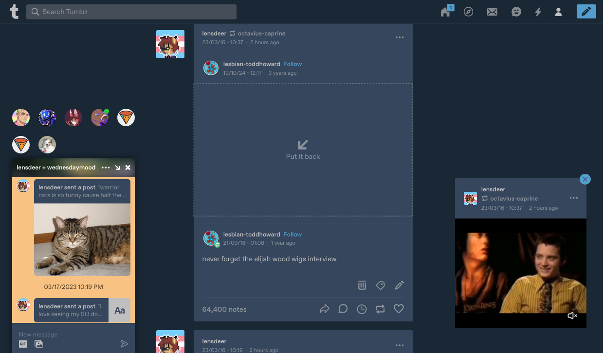

# tumblr-center-dash.user.css

Simple userstyle to hide Tumblr's sidebar and center the Dashboard. 

 
<a href="https://userstyles.world/style/8904/tumblr-center-dash">(Get on UserStyles.world)</a>
